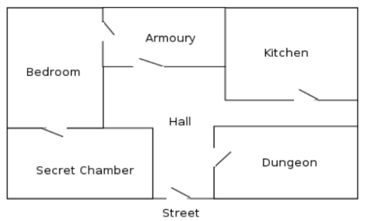

# Lista de Exercícios

## Exercício 1

Dado o programa em Prolog abaixo, execute a consulta `?- p(X).` buscando obter todas as respostas possíveis. Explique porque cada resposta foi obtida e porque só essas respostas foram encontradas.

```prolog
% p/1
p(a).
p(b):-
    !.
    p(c).


:- begin_tests(test).

    % Ao consultar por todos os valores possíveis, apenas "a" e "b" são retornados pois um operador de corte é encontrado logo após validar a letra "b".
    test(p) :-
        findall(X, p(X), L),
        =(L, [a,b]).

    % Enquanto ao se consultar somente pelo valor "c", ele é considerado válido.
    test(p) :-
        p(c).

:- end_tests(test).

```

```shell
?- [exercicio_1].
true.

?- p(X).
X = a ;
X = b.

?- run_tests.
% PL-Unit: test .. done
% All 2 tests passed
true.

?-
```

## Exercício 2

Explique, de modo preciso e sucinto, o que o predicado Prolog `p/2` abaixo faz.

```prolog
% p/2
% verifica se o elemento cabeça dos dois conjuntos é igual
p([H|_],[H|_]).


:- begin_tests(test).

    test(p) :-
        p([a],[a]).

    test(p) :-
        p([a,b],[a,c]).

    test(p) :-
        p([c,b],[c,b]).

    test(p, [fail]) :-
        p([b],[a]).

    test(p, [fail]) :-
        p([b,a],[a,b]).

:- end_tests(test).
```

```bash
?- [exercicio_2].
true.

?- run_tests.
% PL-Unit: test ..... done
% All 5 tests passed
true.

?-
```

## Exercício 3

Supondo que os elementos de um conjunto são apresentados sob a forma de uma lista, programe o predicado `pertence_a_interseccao/3`, onde  `pertence_a_interseccao(E, A, B)` se o elemento E pertence à intersecção dos conjuntos A e B.

```prolog
% pertence_a_interseccao/3
% onde pertence_a_interseccao(E, A, B) se o elemento E pertence à intersecção dos conjuntos A e B

pertence_a_interseccao(E, A, B) :-
    pertence(E, A),
    pertence(E, B).

pertence(E, [E|_]) :- !.

pertence(E, [_|T]) :-
    pertence(E, T).


:- begin_tests(test).

    test(pertence_a_interseccao) :-
        pertence_a_interseccao(a, [a,b], [a,c]).

    test(pertence_a_interseccao) :-
        pertence_a_interseccao(a, [b,a], [a,c]).

    test(pertence_a_interseccao) :-
        pertence_a_interseccao(a, [b,a,b], [c,b,a]).

    test(pertence_a_interseccao, [fail]) :-
        pertence_a_interseccao(a, [b,c], [a,b]).

    test(pertence_a_interseccao, [fail]) :-
        pertence_a_interseccao(a, [b,c], [d,b]).

:- end_tests(test).

```

```bash
?- [exercicio_3].
true.

?- run_tests.
% PL-Unit: test ..... done
% All 5 tests passed
true.

?-
```

## Exercício 4

Supondo que os elementos de um conjunto são apresentados sob a forma de uma lista, programe o predicado `nao_elemento/2`, onde `nao_elemento(E, C)` se E não é um elemento do conjunto C.

```prolog
% nao_elemento/2
% onde nao_elemento(E, C) se E não é um elemento do conjunto C

nao_elemento(E, C) :-
    \+ pertence(E, C).

pertence(E, [E|_]) :- !.

pertence(E, [_|T]) :-
    pertence(E, T).


:- begin_tests(test).

    test(nao_elemento) :-
        nao_elemento(a, [b]).

    test(nao_elemento) :-
        nao_elemento(a, [b,c]).

    test(nao_elemento, [fail]) :-
        nao_elemento(a, [a,b,c]).

    test(nao_elemento, [fail]) :-
        nao_elemento(a, [b,a,c]).

:- end_tests(test).

```

```bash
?- [exercicio_4].
true.

?- run_tests.
% PL-Unit: test .... done
% All 4 tests passed
true.

?-
```

## Exercício 5

Caça ao tesouro. Um tesouro está escondido em um determinado cômodo de  um apartamento (muito estranho!) cuja planta baixa está desenhada na figura abaixo.



As portas dos cômodos estão sempre abertas. No estranho apartamento não há mobília alguma (mas há um tesouro). Você, o caçador do tesouro, inicia a busca na rua.

Implemente um predicado `planeje(ache(tesouro))` que irá retornar a lista ordenada de ações que será executada para achar o tesouro. Cada ação irá consistir em predicados do tipo `mova_de(a,b)`, `mova_de(b,c)` etc. e `pegue(tesouro)`.

Teste o predicado para 3 (três) localizações iniciais diferentes do tesouro. Para colocar o tesouro em um dado cômodo, em cada teste, use um predicado `assert(local(tesouro, comodo))`.

```prolog
mova_de(street, hall).
mova_de(hall, dungeon).
mova_de(hall, kitchen).
mova_de(hall, armoury).
mova_de(armoury, bedroom).
mova_de(bedroom, secret_chamber).

planeje(ache(tesouro)) :-
    ache(tesouro, Retorno),
    write(Retorno).

ache(tesouro, Retorno) :-
    local(tesouro, X),
    profundidade([], street, X, R1),
    reverse(R1, Retorno).

% Busca em profundidade
profundidade(Caminho, Fim, Fim, [pegue(tesouro)|Caminho]) :- !.
profundidade(Caminho, Inicio, Fim, Retorno):-
    mova_de(Inicio, Proximo),
    \+ member(mova_de(Inicio, Proximo), Caminho),
    profundidade([mova_de(Inicio, Proximo)|Caminho], Proximo, Fim, Retorno).

```

```bash
?- assert(local(tesouro, kitchen)), planeje(ache(tesouro)).
[mova_de(street,hall),mova_de(hall,kitchen),pegue(tesouro)]
true.

?- assert(local(tesouro, secret_chamber)), planeje(ache(tesouro)).
[mova_de(street,hall),mova_de(hall,armoury),mova_de(armoury,bedroom),mova_de(bedroom,secret_chamber),pegue(tesouro)]
true.

?- assert(local(tesouro, bedroom)), planeje(ache(tesouro)).
[mova_de(street,hall),mova_de(hall,armoury),mova_de(armoury,bedroom),pegue(tesouro)]
true.
```
